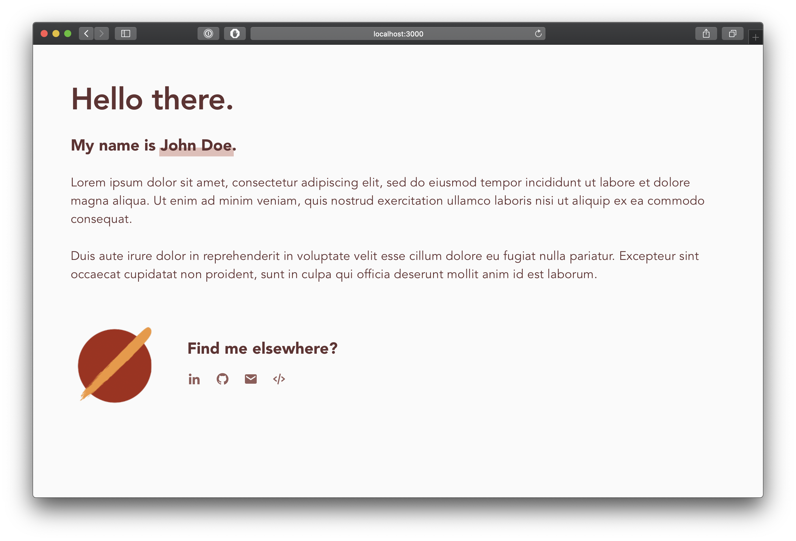

## Available Scripts

In the project directory, you can run:

### `yarn start`

Runs the app in the development mode. 
Open [http://localhost:3000](http://localhost:3000) to view it in the browser.

The page will reload if you make edits. 
You will also see any lint errors in the console.

### `yarn test`

Launches the test runner in the interactive watch mode. 
See the section about [running tests](https://facebook.github.io/create-react-app/docs/running-tests) for more information.

### `yarn build`

Builds the app for production to the `build` folder. 
It correctly bundles React in production mode and optimizes the build for the best performance.

The build is minified and the filenames include the hashes. 
Your app is ready to be deployed!

See the section about [deployment](https://facebook.github.io/create-react-app/docs/deployment) for more information.

## Relevant screenshots

### Overview

## Customise and build your own introduction website using this repository.

To build your own introduction website with this repository, you will only need to change the files in `src/constants/index.ts` and `src/constants/links.ts`.

Relevant variables in `src/constants/index.ts`

Variable | Description
:--- | :---
`appName` | The name of your introduction website that will be shown as your website title (on tabs).
`name` | Your display name.
`greeting` | The header of your introduction.
`aboutTextParagraphs` | A short summary or description of yourself.

Relevant variables in `src/constants/links.ts`

Variable | Description
:---: | :---
`links` | The list of social links that you want to share. By default LinkedIn, Github, email, and source code options are supported.
